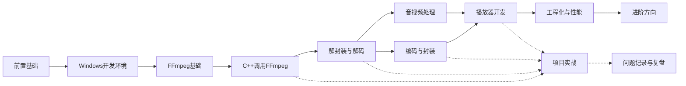

# FFmpeg + C++ 学习知识库 - 主索引

## 学习目标

- [ ] 完成 Windows C++ 开发环境
- [ ] 理解 FFmpeg 的核心对象和调用流程
- [ ] 能完成音视频解封装、解码、编码和封装
- [ ] 能完成常见音视频处理任务
- [ ] 能构建一个可用的播放器
- [ ] 能完成项目工程化、调试、性能分析和部署
- [ ] 能继续进入硬件加速、网络流媒体和源码阅读

## 主线关系

## 学习阶段

| 阶段 | 入口 |
|---|---|
| 阶段 01：前置基础 | [[01-前置基础/阶段01-前置基础]] |
| 阶段 02：Windows 开发环境 | [[02-Windows开发环境/阶段02-Windows开发环境]] |
| 阶段 03：FFmpeg 基础 | [[03-FFmpeg基础/阶段03-FFmpeg基础]] |
| 阶段 04：用 C++ 调用 FFmpeg | [[04-C++调用FFmpeg/阶段04-C++调用FFmpeg]] |
| 阶段 05：解封装与解码 | [[05-解封装与解码/阶段05-解封装与解码]] |
| 阶段 06：编码与封装 | [[06-编码与封装/阶段06-编码与封装]] |
| 阶段 07：音视频处理 | [[07-音视频处理/阶段07-音视频处理]] |
| 阶段 08：播放器开发 | [[08-播放器开发/阶段08-播放器开发]] |
| 阶段 09：工程化与性能 | [[09-工程化与性能/阶段09-工程化与性能]] |
| 阶段 10：进阶方向 | [[10-进阶方向/阶段10-进阶方向]] |
| 阶段 11：项目实战 | [[11-项目实战/阶段11-项目实战]] |
| 阶段 12：问题记录与复盘 | [[12-问题记录与复盘/阶段12-问题记录与复盘]] |

## 总体进度

- [ ] 阶段 01：前置基础
- [ ] 阶段 02：Windows 开发环境
- [ ] 阶段 03：FFmpeg 基础
- [ ] 阶段 04：用 C++ 调用 FFmpeg
- [ ] 阶段 05：解封装与解码
- [ ] 阶段 06：编码与封装
- [ ] 阶段 07：音视频处理
- [ ] 阶段 08：播放器开发
- [ ] 阶段 09：工程化与性能
- [ ] 阶段 10：进阶方向
- [ ] 阶段 11：项目实战
- [ ] 阶段 12：问题记录与复盘

