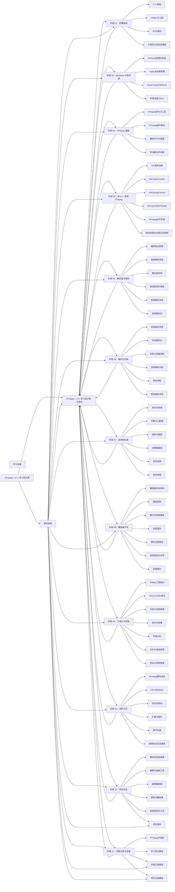

# Knowledge Graph

Generated on 2026-09-29. Obsidian users can also use the native graph view.

```mermaid
graph LR
    n0["FFmpeg + C++ 学习知识库 - 主索引"]
    n1["学习进度"]
    n2["C++基础"]
    n3["CMake与工程"]
    n4["Git与调试"]
    n5["计算机与音视频基础"]
    n6["阶段 01：前置基础"]
    n7["FFmpeg构建与安装"]
    n8["vcpkg与依赖管理"]
    n9["Visual Studio与MSVC"]
    n10["环境变量与DLL"]
    n11["阶段 02：Windows 开发环境"]
    n12["FFmpeg命令行工具"]
    n13["FFmpeg组件概览"]
    n14["媒体文件与容器"]
    n15["时间戳与时间基"]
    n16["阶段 03：FFmpeg 基础"]
    n17["API调用流程"]
    n18["AVCodecContext"]
    n19["AVFormatContext"]
    n20["AVFrame与AVPacket"]
    n21["FFmpeg日志系统"]
    n22["错误处理与资源生命周期"]
    n23["阶段 04：用 C++ 调用 FFmpeg"]
    n24["像素格式转换"]
    n25["视频解码流程"]
    n26["解封装流程"]
    n27["阶段 05：解封装与解码"]
    n28["音视频同步基础"]
    n29["音频解码流程"]
    n30["音频重采样"]
    n31["封装输出流程"]
    n32["时间戳写出"]
    n33["码率与质量控制"]
    n34["视频编码流程"]
    n35["转码流程"]
    n36["阶段 06：编码与封装"]
    n37["音频编码流程"]
    n38["剪切与拼接"]
    n39["字幕与元数据"]
    n40["抽帧与截图"]
    n41["滤镜图基础"]
    n42["视频滤镜"]
    n43["阶段 07：音视频处理"]
    n44["音频滤镜"]
    n45["播放器总体架构"]
    n46["播放控制"]
    n47["缓冲与网络播放"]
    n48["视频渲染"]
    n49["解码线程模型"]
    n50["阶段 08：播放器开发"]
    n51["音视频同步实现"]
    n52["音频输出"]
    n53["CMake工程组织"]
    n54["Visual Studio调试"]
    n55["内存与资源管理"]
    n56["发布与部署"]
    n57["性能分析"]
    n58["日志与错误管理"]
    n59["测试与样例管理"]
    n60["阶段 09：工程化与性能"]
    n61["FFmpeg源码阅读"]
    n62["GPU与D3D11"]
    n63["实时音视频"]
    n64["扩展与插件"]
    n65["硬件加速"]
    n66["网络协议与流媒体"]
    n67["阶段 10：进阶方向"]
    n68["媒体信息查看器"]
    n69["截图与抽帧工具"]
    n70["桌面播放器"]
    n71["网络流播放器"]
    n72["阶段 11：项目实战"]
    n73["音视频转码工具"]
    n74["项目清单"]
    n75["FFmpeg术语表"]
    n76["学习笔记模板"]
    n77["问题记录模板"]
    n78["阶段 12：问题记录与复盘"]
    n79["项目复盘模板"]
    n80["FFmpeg + C++ 学习知识库"]
    n81["使用指南"]
    n0 --> n6
    n0 --> n11
    n0 --> n16
    n0 --> n23
    n0 --> n27
    n0 --> n36
    n0 --> n43
    n0 --> n50
    n0 --> n60
    n0 --> n67
    n0 --> n72
    n0 --> n78
    n6 --> n0
    n6 --> n2
    n6 --> n3
    n6 --> n4
    n6 --> n5
    n11 --> n0
    n11 --> n7
    n11 --> n8
    n11 --> n9
    n11 --> n10
    n16 --> n0
    n16 --> n12
    n16 --> n13
    n16 --> n14
    n16 --> n15
    n23 --> n0
    n23 --> n17
    n23 --> n18
    n23 --> n19
    n23 --> n20
    n23 --> n21
    n23 --> n22
    n27 --> n0
    n27 --> n24
    n27 --> n25
    n27 --> n26
    n27 --> n28
    n27 --> n29
    n27 --> n30
    n36 --> n0
    n36 --> n31
    n36 --> n32
    n36 --> n33
    n36 --> n34
    n36 --> n35
    n36 --> n37
    n43 --> n0
    n43 --> n38
    n43 --> n39
    n43 --> n40
    n43 --> n41
    n43 --> n42
    n43 --> n44
    n50 --> n0
    n50 --> n45
    n50 --> n46
    n50 --> n47
    n50 --> n48
    n50 --> n49
    n50 --> n51
    n50 --> n52
    n60 --> n0
    n60 --> n53
    n60 --> n54
    n60 --> n55
    n60 --> n56
    n60 --> n57
    n60 --> n58
    n60 --> n59
    n67 --> n0
    n67 --> n61
    n67 --> n62
    n67 --> n63
    n67 --> n64
    n67 --> n65
    n67 --> n66
    n72 --> n0
    n72 --> n68
    n72 --> n69
    n72 --> n70
    n72 --> n71
    n72 --> n73
    n72 --> n74
    n78 --> n0
    n78 --> n75
    n78 --> n76
    n78 --> n77
    n78 --> n79
    n80 --> n0
    n80 --> n81
    n81 --> n0
    n81 --> n6
    n81 --> n11
    n81 --> n16
    n81 --> n23
    n81 --> n27
    n81 --> n36
    n81 --> n43
    n81 --> n50
    n81 --> n60
    n81 --> n67
    n81 --> n72
    n81 --> n74
    n81 --> n77
    n81 --> n78
    n81 --> n79
    classDef session fill:#f4f4f4,stroke:#666,color:#222
    classDef topic fill:#e7f3ff,stroke:#2774a8,color:#13293d
    classDef decision fill:#fff2cc,stroke:#a67c00,color:#3d3000
    classDef runbook fill:#e5f5e0,stroke:#3a7d44,color:#173d1d
    classDef snippet fill:#f3e8ff,stroke:#7651a8,color:#2f1b47
    classDef archived fill:#eeeeee,stroke:#999,color:#555
```
